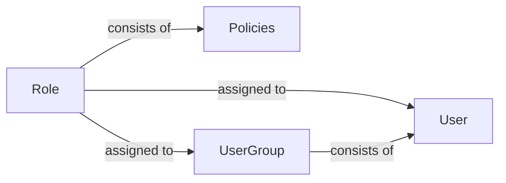
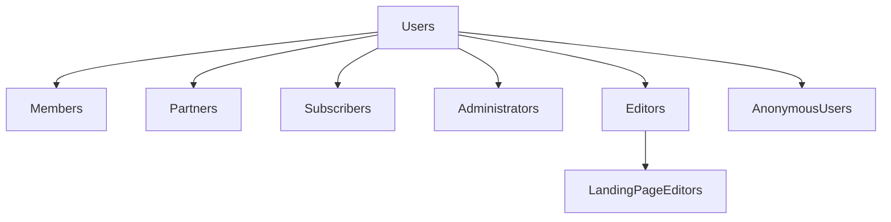
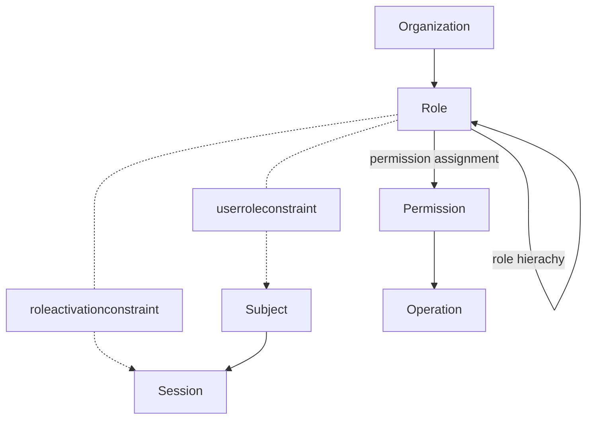
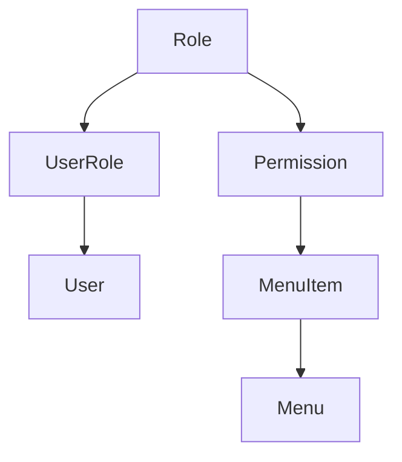
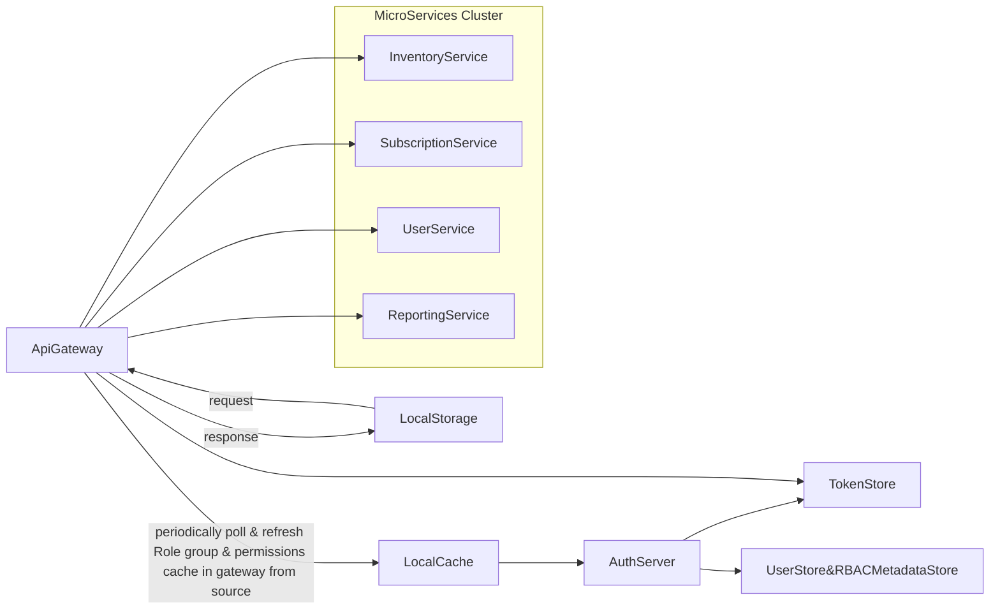
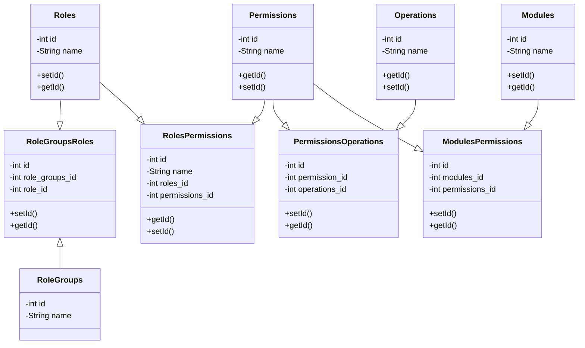
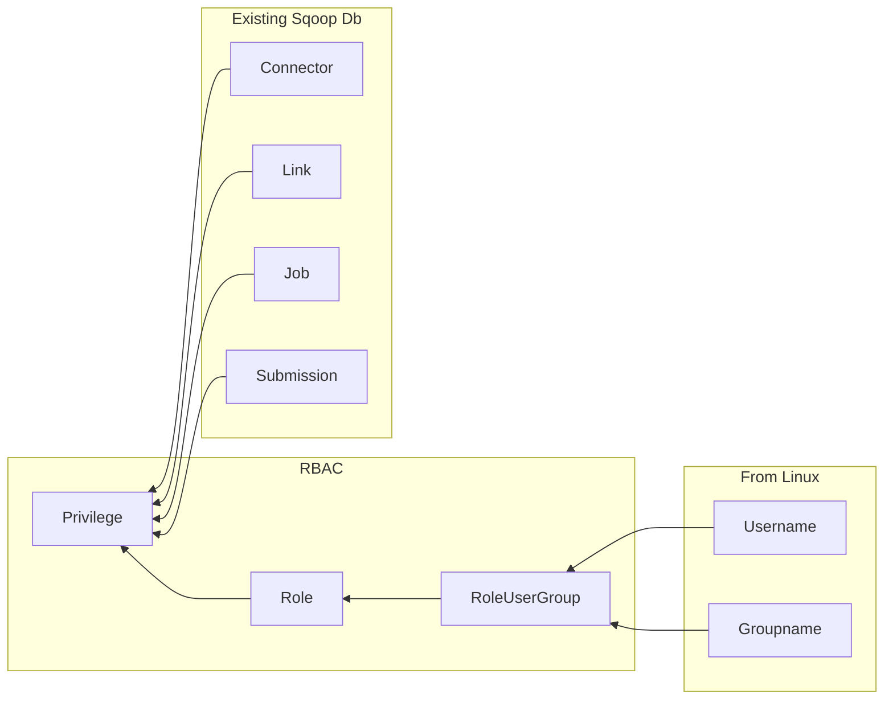

References:
1. [ASP.NET's Membership, Roles, and Profile by  Scott Mitchell](http://aspnet.4guysfromrolla.com/articles/120705-1.aspx)
2. [Blog-Secure by Default: why the role-based permission model offers powerful security by Bård Farstad](https://ez.no/Blog/Secure-by-default-why-the-role-based-permission-model-offers-powerful-security)
3. [Role-based access control, wikipedia](https://en.wikipedia.org/wiki/Role-based_access_control)
4. [Designing an Enterprise Role-Based Access Control(RBAC) System by Justin Baker](https://hackernoon.com/designing-an-enterprise-role-based-access-control-rbac-system-96e645c659b7)
5. [Paper-Role-Based Access Controls by David F. Ferraiolo](https://csrc.nist.gov/CSRC/media/Publications/conference-paper/1992/10/13/role-based-access-controls/documents/ferraiolo-kuhn-92.pdf)
6. [Publications-Computer Security Resource Center,by NIST US GOV ](https://csrc.nist.gov/publications)
7. [Blog-How To Structure Permissions In A SaaS App, by Dorian Johnson](https://heap.io/blog/engineering/structure-permissions-saas-app)
8. [Example Implementation-Sirv Users, Roles and Permissions](https://sirv.com/help/resources/users-roles-permissions/)
9. [Answered Question-How to simplify this Role and Permission Management Design](https://softwareengineering.stackexchange.com/questions/324390/how-to-simplify-this-role-and-permission-management-design)
10. [Blog-Role Based Access Control for Microservices, by ELANKUMARAN SRINIVASAN](https://elang2.github.io/myblog/posts/2018-09-29-Role-Based-Access-Control-MicroServices.html)
11. [Designing a Complete Model of Role-based Access Control
System for Distributed Networks, by CHANG N. ZHANG AND CUNGANG YANG](https://pdfs.semanticscholar.org/8364/990cec1bf92cb2179a351e473fe01056fbc8.pdf)
12. [Users and Roles, by sumo logic](https://help.sumologic.com/Manage/Users-and-Roles)
13. [Simple, Secure Role Based Access Control(RBAC) For REST APIs by Noa Kuperberg](https://cloudify.co/2016/04/15/simple-secure-role-based-access-control-rest-api-rbac-server-devops-cloud-orchestration.html)
14. [Blog-High Level Design of Role Based Access Controller, by Richard at Confluence](https://cwiki.apache.org/confluence/display/SQOOP/High+Level+Design+of+Role+Based+Access+Controller)
15. [Github-Access Control Cheatsheet, by Sheerazali](https://github.com/OWASP/CheatSheetSeries/blob/master/cheatsheets/Access_Control_Cheat_Sheet.md)
16. [HTML Character Entity Reference Chart](https://dev.w3.org/html5/html-author/charref)
17. [What is RBAC for Azure resources,by Microsoft](https://docs.microsoft.com/en-us/azure/role-based-access-control/overview)

# Role-Based Access Design
## Example Role Methods:
1. CreateRole(RoleName): Adds a new role in the system
2. DeleteRole(RoleName): Deletes a role from the system
3. AddUserToRole(Username, RoleName): Adds a particular user to a particular role
4. IsUserInRole(RoleName) or IsUserInRole(Username, RoleName): Checks if the currently logged in or given user is a given role
5. GetAllRoles(): Gets a list of all roles
6. GetRolesForUser() or GetRolesForUser(username): Gets a list of all roles for the currently logged in  or given user

## A) Permission Management
* Roles and Policies
## B) User Management
* Users and User Groups
## C) Anonymous Role
- Even anonymous visitors, i.e., visitors not logged in, have roles assigned to them
- If no functions are defined for a given role, the user can access nothing
## Example Anonymous(Role) Policy
Module | Function | Limitation
------ | -------- | ----------
content | Read | Class(Files, Images, Banners, Users); Section(Media)
content | Read | Section(Standard)
- This design concept means that you, the admin both can see what a specific role a user can access, and that you have to explicitly define if those users should have acess to a function or specific content type
- In this case, the structure of the App should be divided into modules and functions
- Modules and functions can map to controllers and their actions
- Limitations are also applied to queries being done by the search system, making sure content returned is accessible to the current user
## Example Hierarchical Permission Model for User Account

# Role-Based Access Control(RBAC)
- An approach to restricting system access to authorized users
- It can implement Mandatory Access Control(MAC) or Discretionary Access Control(DAC)
- It is defined around roles and privileges
- The components of RBAC such as Role-Permissions, User-Role and Role-Role relationships make it simple to perform user assignments
## RBAC Design
- The permissions to perform certain operations are assigned to specific roles
- Members or staff(or other system users) are assigned particular roles, and through those role assignements acquire the permissions needed to peroform particular system functions
- Since users are not assigned permissions directly but only acquire them through their role(or roles), management of individual user rights becomes a matter of simply assigning appropriate roles to the user's accounts
## Three Primary Rules That Define RBAC
### 1. Role Assignment
- A subject can exercise a permission only if the subject has selected or been assigned a role
### 2. Role Authorization
- A subject's active role must be authorized for the subject
- With Rule 1, this rule ensures that users can take only roles for which they are authorized
### 3. Permission Authorization
- A subject can exercise a permission only if the permission is authorized for the subject's active role
- With Rules 1 and 2, this ensures that users can exercise only permissions for which they are authorized
## RBAC Model Conventions
- When defining an RBAC model, the following conventions are useful:
1. S = Subject = A person or automated agent
2. R = Role = Job function defining an authority level
3. P = Permission = An approach of a mode of access to resources
4. SE = Session = A mapping involving S, R, and/or P
5. SA = Subject Assignment
6. PA = Permission Assignment
7. RH = Partially ordered role hierarchy
- RH can also be written as: &GreaterEqual;(The notation: x&GreaterEqual;y means that x inherits the permissions of y)
- A subject can have multiple roles
- A role can have multiple subjects
- A role can have many permissions
- A permission can be assigned to many roles
- An operation can be assigned to many permissions
- A permission can be assigned to many operations

### _NOTE: Constraints_
- A constraint places a restrictive rule on the potential inheritance of permissions from opposing roles, thus it can be used to achieve separation of duties
- For example, the same person should not be allowed to both create a login account and to authorize the account creation
- Using set theory notation:

  1. PA &SubsetEqual; P X R and is a many to many permission to role assignment relation
  2. SA &SubsetEqual; S X R and is a many to many subject to role assignment relation
  3. RH &SubsetEqual; R X R 
- A subject may have multiple simultaneous sessions within different roles
## RBAC Model Diagram

## Example RBAC Implementation
### RBAC GUI
User Name | Assigned Roles | Options
--------- | -------------- | -------
John Smith | Root Access; User Management; General Access | [edit]
Teresa Appleseed | Marketing Access; General Access | [edit]
Anonymous | General Access | [edit]

#### Manage Role
***Name:*** *&nbsp;Root Access*<br>
***Description***: &nbsp;*Manages access to the RCPs and primary databases for system administrators*<br>
***Policy:***

Resource | Effect | Action | Add/Remove
-------- | ------ | ----------- | ----------
RCPs Database&caron; | Allow&caron; | UpdateDB; DeleteDBItem| -
Primary Databases&caron; | Deny&caron; | DeleteDB; | + -
*<small>Select Resource</small>*&caron; | *<small>Effect</small>*&caron; | *<small>Add an action</small>* | + -

***SAVE***

### Defining a role
- A role should have five semantic components:
  1. **Name:** A human readable and business friendly way to identify a role
  2. **Description:** The role's purpose, clearly defined
  3. **Tags:** Important for managing multiple roles and creating roles to manage the roles
  4. **Assignments:** Assigning roles to individuals or groups of individuals
  5. **Plocies:** Specific rules and permission sets assigned to a role
### Defining a Policy
-A policy has one primary component:
1. Array of Strategies
    - A policy can have may statements
    - You should be able to save policies and re-use them across multiple roles
    - in other words, a policy is a collection of specific permission rules
### Defining a Statement
- A statement has three components:
1. Resource
    - The targeted feature, environment, or operation
2. Effect
    - Typically "Allow" or "Deny"
3. Action
    - A resource can have many actions, like deleteUser, addUser, modifyUser
    - These actions should have human readbale names, like "Delete a User" for "deleteUser"
- Example Statement:
```
{
  "effect": "deny",
  "resource": [
    "prod/primaryDB/*"
  ],
  "actions": [
    "deleteDB"
  ]
}
```
### Mapping Roles
- You should be able to assign multiple roles to an individual user
- Ideally, you would have a clear user interface that allows you to build these roles and attach them to individual users or groups of users
### Avoiding Technical Debt
- It is very common amongst large companies to acrue hundreds or thousands of roles over time
- Having an intuitive GUI lets you manage this debt, keep your roles up-to-date, and keep your system secure
## Multi-Role Relationship Diagram
```mermaid
graph TD;
User1-->|member_of|Healer
User2-->|member_of|Healer
User3-->|member_of|Healer
Healer-->|trans_a|Object1
Healer-->|trans_b|Object2
User4-->|member_of|Intern
User5-->|member_of|Intern
User6-->|member_of|Intern
Intern-->|trans_c|Object3
Intern-->|trans_d|Object4
Intern-->|member_of|Healer
User7-->|member_of|Doctor
User8-->|member_of|Doctor
User9-->|member_of|Doctor
Doctor-->|trans_e|Object5
Doctor-->|trans_f|Object6
Doctor-->|member_of|Intern
````
- By granting membership to the role Doctor, it implies access to all transactions defined by Intern and Healer, as well as those of a Doctor
- On the other hand, by granting membership to the Intern role, this implies transactions of the Intern and Healer not the Doctor
- However, by granting membership to the Healer role, this only allows access to those resources allowed under the role Healer
## Example Implementing RBAC For APIs
1. **Check Operations on Permissions, Not Roles**
- Make sure to do it in terms of permissions, which should exist in a first class form in your codebase
- For example, you never want your code to look like this:
```
if(User.role in ['admin','marketer']){
  ....
}
```
- You would always want your code to look like:
```
if(User.can(Permissions.EDIT_REPORT, report)){
  ....
}
```
- This is because a role allows you to glob together as many permissions as you need
- The permissions themselves can be extremely granular
- This allows you to move permissions between roles easily without needing to change your front-end code
- You can even make custom roles for different customers, based on however they want the product to be accessed, without changing any front-end code
2. **Positive, Never Negative**
- There is likely some baseline functionality thate every single user of your application can do
- For sensitive apps, this might be extremely limited, e.g., logging in and nothing else
- This is what all users should start with, and nothing more
- Beyond that baseline, permissions should grant access ***additively***, never ***negatively***
- Negative permissions cause conflicts if a subject has more than one role, since its unclear which role "wins", and resolving that conflict creates many problems
3. **Extensions**
- As your product matures, you may want to icorporate some additional concepts into your permissions system
## RBAC Example Roles
1. **Primary Owner**
- The person who creates the account automatically becomes the **Primary Owner**
- They have total control over the account and only they can transfer ownership to another user
- Unlike other roles, there can only be one **Primary Owner** per account
2. **Owner**
- Senior managers of your team with responsibility for adding new users, maintaining existing users and billing can be added as owners
- Owners have almost full control over the account
- An account can have multiple Owners
3. **Admin**
- Technical administrators have complete control over the files in the account
- They can appoint new users and change existing user roles except ***Owner roles***
- They cannot view or manage any billing information
- Admins can lock/unlock folders(Enterprise Accounts Only), making this a powerfull role
4. **Editor**
- This role gives access to all day-to-day file management operations(upload, delete, rename, move and copy)
- Editors are unable to empty the trash, so if files are deleted in error, the ***Owner*** or ***Admin*** user is able to retrieve them for 30 days
- If a folder has been locked, editrs and contributors cannot delete, rename or overwrite any of its files or subfolders
5. **Contributor**
- A limited role, contributors can add content to your account(uploading and creating new folders and files)
- They cannot move, copy, rename or delete any files folders
6. **Viewer**
-A very limited role, viewer can only view files and download them
7. **Billing**
-Ideal for finance and accounting dtaff, this role gives complete payment capabilities with minimal file capabilities
## Example RBAC Implementation

- Then you can create a view so you don't have to write the joins for the permissions every time
## Example RBAC System Design For Microservices
- The model is built on a hierarchical relational manner with the Role group forming the top level.
- Permissions required to perform a certain role ( example: vendor, user, subscriber, admin) etc. are grouped under appropriate roles. 
- A role group can contain one or more roles under it. 
- This mean that, role-groups inherit combined permissions of all roles under it. 
- Permissions can be further controller by modules if needed.

***Notes:*** <br>
1. Role group assignments are done during user login and role group is associated with the token and stored in the store
2. API gateway has its own cache of the role-group and permissions metadata. The Role-group information in the token store is used to derive permissions
3. API gateway can route requests to appropriate microservices/modules and also send appropriate permissions through header to these devices
4. The microservice will evaluate the permissions to see what the user has access to and not
5. Clients can cache the user permissions & initial HASH during login for any UI treatment. Server send a HASH of user permissions to client as part of every response. A change in permission on server side will result in a different HASH being sent from the server.
## APPROACH
1. A dedicated set of database tables to hold the role groups, roles and permissions relationships. 
- One service will be responsible for retrieving permissions for a given list of role groups.



2. Which user gets what role group business logic will be encapsulated in the Auth Server. 
- User information will be evaluated during login to derive the role group that needs to be assigned. 
- The role group will be attached to the tokens generated as part of OAuth2 process.

3. The API gateway validates the user tokens and invokes the underlying micro-service API's. 
- The API gateway will have a local cache of map of role groups and associated permission. 
- This cache will be periodically refresh by reaching out to Auth Server in the background. 
- This refresh ensures that the API gateway always has access to any permission changes made by the RBAC Admin in the metadata system.

4. The API gateway lookup the user token, extracts the user details and assigned role groups. 
- It then derives the associated permissions from the cached data and then sends down the permission to the micro-services as part of enriched request headers.

5. All microservices can use a common library to evaluate if "READ" or "EXECUTE" permissions are available to perform a certain action. 
- The presence or absence of the permission will control the API response behavior.

6. The clients can cache the list of permissions available to the user to control UI treatment and behavior. 
- Permission SYNC between the server and the client can be triggered when the HASH of permissions cached on the client doing login flow turns out to be different from the permission HASH that is sent by the clients as part of every API response.
### Below are some example metadata for the RBAC system.
#### ROLE_GROUPS
 Id | Name
 -- | ----
 1 | Subscriber
 2 | NON_SUBSCRIBER
#### ROLES
Id | Name
-- | ----
1 | Profile
2 | Reporting
#### ACTIONS
Id | Name
-- | ----
1 | View
2 | Execute

#### OPERATIONS
Id | Name
-- | ----
1 | USER_PROFILE
2 | EXPENSE_REPORT
3 | INVENTORY_LIST
#### PERMISSIONS
Id | Name
-- | ----
1 | VIEW_USER_PROFILE
2 | EXECUTE_EXPENSE_REPORT
3 | VIEW_INVENTORY_LIST
#### MODULES
Id | Name
-- | ----
1 | PROFILE
2 | REPORTS
3 | SUBSCRIPTION

 ## High Level Design of Role Based Access Controller, As Used in Sqoop 2
 ### Problem
 - Sqoop 2 needs a pluggable role based access controller (RBAC), which is responsible for the authorization to Sqoop 2 resources, such as server, connector, link, job, etc.
 ### Basic Idea
 - The access controller is pluggable
 - Set controller class in sqoop.properties
 - The default implement in Sqoop 2 could be a FAKE controller (always return true)
 - The access controller class could be implemented by other controller framework, such as Sentry
Connector
### Resources, actions and rules
Server has three children: Connector, Link, Job.

- It is a hierarchy mode. 
- If a user has the privilege of {server, all}, then he/she has all privileges of {connector, all}, {link, all} and {job, all}.
- If a user has the privilege of {job, all}, then he/she has both privileges of {job, read} and {job, write}.
- If a user wants to create a link, then he/she needs to have the privilege of {server, create}

Resource | Global Namespace
-------- | ----------------
Server | <li>All</li><li>Read</li><li>Write</li>
Connector | <li>All</li><li>Read</li>
Link | <li>All</li><li>Read</li><li>Write</li>
Job | <li>All</li><li>Read</li><li>Write</li>

Action | Privilege Needed
------ | ----------------
show connector | <li>connector read</li>
show link | <li>link read</li>
create link | <li>server create</li><li>connector read</li>
update link | <li>link write</li><li>connector read</li>
delete link | <li>link write</li>
enable link | <li>link write</li>
show job | <li>job read</li>
create job | <li>both links read</li>
update job | <li>job write</li><li>both links read</li>
delete job | <li>job write</li>
enable job | <li>job write</li>
disable job | <li>job write</li>
start job | <li>job write</li>
stop job | <li>job write</li>
show submission | <li>job read</li>

## Authorization Framework
- Restful call API is handled by `org.apache.sqoop.handler.AuthorizationEngine.java in sqoop-server`
- POST /authorization/roles/create
  - Create new role with {name}
- DELETE /authorization/role/{role-name}
- GET /authorization/roles
  - Show all roles
- GET /authorization/principals?role_name={name}
  - Show all principals in role with {name}
- GET /authorization/roles?principal_type={type}&principal_name={name}
Show all roles in principal with {name, type}
- PUT /authorization/roles/grant
  - Grant a role to a user/group/role
  - PUT data of JsonObject role(name) and principal (name, type)
- PUT /authorization/roles/revoke
  - Revoke a role to a user/group/role
  - PUT data of JsonObject role(name) and principal (name, type)
- PUT /authorization/privileges/grant
  - Grant a privilege to a principal
  - PUT data of JsonObject principal(name, type) and privilege (resource-name, resource-type, action, with-grant-option)
- PUT /authorization/privileges/revoke
  - Revoke a privilege to a principal
  - PUT data of JsonObject principal(name, type) and privilege (resource-name, resource-type, action, with-grant-option)
  - If privilege is null, then revoke all privileges for principal(name, type)
- GET /authorization/privileges?principal_type={type}&principal_name={name}&resource_type={type}&resource_name={name}
  - Show all privileges in principal with {name, type} and resource with {resource-name, resource-type}
  - If resource is null, then show all privileges in principal with {name, type}
### Database Design

- Role table
  - Id
  - Name
  - Comment
    - Role name could be admin, developer, user, etc.
- Role_User_Group table
  - Id
  - Role_id
  - User_name
  - Group_name
  - Comment
    - The information of user and group comes from Linux or LDAP etc.
    - Only one of user name and group name is set. If user name is set and leave group name empty, it means that this user has this rule. If group name is set and leave user name empty, it means that all users in this group has this rule.
    - One user/group could have one or multiple roles.
- Privilege table
  - Id
  - Role_id
  - Resource_id
  - Resource_type
  - Action_type
  - Comment
    - Resource type could be the existing resource table, such as connector, link, job, etc.
    - Resource type could be added in the future, say config etc.
    - If resource_id is 0, it means all resource of this type, ie. resource_id=0 and resource_type=link means all links.
    - Use resource id and resource type to identify the resource, ie. resource_id=1 and resource_type=link means the resource of “select * from link where id =1”.
    - Action type could be read, create, update, delete, use etc.
- Accordingly, MRole, MRoleUserGroup and MPrivilege classes are added into package org.apache.sqoop.model.

# What is role-based access control (RBAC) for Azure resources?
- Access management for cloud resources is a critical function for any organization that is using the cloud.
- Role-based access control (RBAC) helps you manage who has access to Azure resources, what they can do with those resources, and what areas they have access to.
- RBAC is an authorization system built on Azure Resource Manager that provides fine-grained access management of Azure resources.
## What can I do with RBAC?
- Here are some examples of what you can do with RBAC:
  - Allow one user to manage virtual machines in a subscription and another user to manage virtual networks
  - Allow a DBA group to manage SQL databases in a subscription
  - Allow a user to manage all resources in a resource group, such as virtual machines, websites, and subnets
  - Allow an application to access all resources in a resource group
## Best practice for using RBAC
- Using RBAC, you can segregate duties within your team and grant only the amount of access to users that they need to perform their jobs. 
- Instead of giving everybody unrestricted permissions in your Azure subscription or resources, you can allow only certain actions at a particular scope.
- When planning your access control strategy, it's a best practice to grant users the least privilege to get their work done. 
- The following diagram shows a suggested pattern for using RBAC:

Scope | Reader | Resource-specific or custom role | Contributor | Owner
------ | ------ | ---------------------------- | ------- | -------------
Subscription <br> Resource Group | Observers | Users Managing resources | | Admins
Resource | Automated processes

## How RBAC works
- The way you control access to resources using RBAC is to create **role assignments.** 
- This is a key concept to understand – it’s how permissions are enforced. 
- A role assignment consists of three elements: ***security principal***, ***role definition***, and ***scope***.
### Security principal
- A security principal is an object that represents a user, group, service principal, or managed identity that is requesting access to Azure resources.
  - **User** - An individual who has a profile in Azure Active Directory.  
  You can also assign roles to users in other tenants. For information about users in other organizations, see Azure Active Directory B2B.
  - **Group** - A set of users created in Azure Active Directory. 
  When you assign a role to a group, all users within that group have that role.
  - **Service principal** - A security identity used by applications or services to access specific Azure resources. 
  You can think of it as a user identity (username and password or certificate) for an application.
  - **Managed identity** - An identity in Azure Active Directory that is automatically managed by Azure. 
  You typically use managed identities when developing cloud applications to manage the credentials for authenticating to Azure services.
### Role Definition
- A role definition is a *collection of permissions.* 
- It's sometimes just called a **role.** 
- A role definition lists the *operations* that can be performed, such as **read**, **write**, and **delete**. 
- Roles can be high-level, like owner, or specific, like virtual machine reader. 
#### Example Roles
1. Owner
2. Contributor
3. Reader
4. Backup Operator
5. Security Reader
6. User Access Administrator
7. Virtual Machine Contributor
8. Reader Support Tickets
9. Virtual Machine Operator
```
Contributor{
  "Actions": [
    "*"
  ],
  "NotActions": [
    "Authorization/*/Delete",
    "Authorization/*/Write",
    "Authorization/elevateAccess/Action"
  ],
  "DataActions": [],
  "NotDataActions: [],
  "AssignableScopes": [
    "/"
  ]
} 
```
- Azure includes several built-in roles that you can use. The following lists four fundamental built-in roles. The first three apply to all resource types.

- **Owner** - Has full access to all resources including the right to delegate access to others.
- **Contributor** - Can create and manage all types of Azure resources but can’t grant access to others.
- **Reader** - Can view existing Azure resources.
- **User Access Administrator** - Lets you manage user access to Azure resources.
- The rest of the built-in roles allow management of specific Azure resources. For example, the Virtual Machine 
- Contributor role allows a user to create and manage virtual machines. If the built-in roles don't meet the specific needs of your organization, you can create your own custom roles for Azure resources.

- Azure has data operations that enable you to grant access to data within an object. 
- For example, if a user has read data access to a storage account, then they can read the blobs or messages within that storage account. For more information, see [Understand role definitions for Azure resources](https://docs.microsoft.com/en-us/azure/role-based-access-control/role-definitions).

### Scope
- Scope is the set of resources that the access applies to. 
- When you assign a role, you can further limit the actions allowed by defining a scope. 
- This is helpful if you want to make someone a Website Contributor, but only for one resource group.

- In Azure, you can specify a scope at multiple levels: management group, subscription, resource group, or resource. 
- Scopes are structured in a parent-child relationship.
```
Scope:
  Management group
    Subscritpion
      Resource map
        Resource
```        
- When you grant access at a parent scope, those permissions are inherited to the child scopes. For example:

  - If you assign the Owner role to a user at the management group scope, that user can manage everything in all subscriptions in the management group.
  - If you assign the Reader role to a group at the subscription scope, the members of that group can view every resource group and resource in the subscription.
  - If you assign the Contributor role to an application at the resource group scope, it can manage resources of all types in that resource group, but not other resource groups in the subscription.
### Role Assignments
- A role assignment is the process of attaching a role definition to a user, group, service principal, or managed identity at a particular scope for the purpose of granting access. 
- Access is granted by creating a role assignment, and access is revoked by removing a role assignment.

- The following diagram shows an example of a role assignment. 
- In this example, the Marketing group has been assigned the Contributor role for the pharma-sales resource group. 
- This means that users in the Marketing group can create or manage any Azure resource in the pharma-sales resource group. 
- Marketing users do not have access to resources outside the pharma-sales resource group, unless they are part of another role assignment.