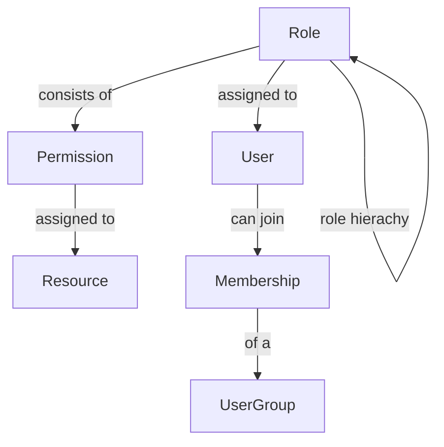

# SILC Server RBAC Design

## SILC Server RBAC Entity Description
1. **Role Entity** 

    Property | Description | Data Type
    -------- | ----------- | ---------
    id | Id of a role(primary key) | GUID
    name | Name of the role(unique) | String
    description | User friendly description of the role | String
    permissions | Array of permission ids assigned to a given role | Array of GUIDs
    parent_role | Reference to parent role to allow for role hierachy and permission inheritance(can be null) | GUID

2. **Permission Entity**

    Property | Description | Data Type | Constraint
    -------- | ----------- | --------- | --------
    id | Id of a permission | GUID | Primary Key
    name | Name of the permission | String | Unique; NotNull
    description | User friendly description of the permission | String | Can be NULL
    resources | Array of references to resources(endpoints) | Array of GUIDs | NotNull

3. **Resource Entity**

    Property | Description | Data Type | Constraint
    -------- | ----------- | --------- | --------
    id | Id of a resource | GUID | Primary Key
    name | Name of the resource | String | Unique; NotNull
    description | User friendly description of the resource | String | Can be NULL
    uri | A uri/url to a resource(path to endpoint) | String | NotNull

3. **User Entity**

    Property | Description | Data Type | Constraint
    -------- | ----------- | --------- | --------
    id | Id of a resource | GUID | Primary Key
    first_name | First Name | String | NotNull
    middle_name | Middle Name | String | Can be Null
    last_name | Last Name | String | NotNull
    sex | Gender | String: "Male", "Female", or "Unknown | NotNull
    date_of_birth | Date of birth | Date | NotNull
    username | Username | String | NotNull
    email | User's email | String | Unique;Can be null
    phone | User's phone | String | Unique;NotNull
    address | User's address{street,city,district,province,country} | String | NotNull
    identification | User's id{national_id, passport, driving_license} | String | NotNull
    membership | References to Array of User Membership Ids | String Array | Can be Null
    roles | References to Array of Role Ids | String Array | NotNull
    fcm_tokens | References to Array of Firebase Cloud Messaging Token Ids | String Array | Can be Null

4. **Membership Entity**

    Property | Description | Data Type | Constraint
    -------- | ----------- | --------- | --------
    id | Id of a UserGroup | GUID | Primary Key
    user_id | Id of the User  | GUID | Foreign Key
    status | Membership Status(Active/Inactive) | String | NotNull
    group_id | Id of the group of membership | String | Foreign Key;NotNULL
    date_joined | Date joined group | Date | NotNull
    date_deactivated | Date user got deactivated from UserGroup | Date | Can be null
    location | UserGroup's location(Town, City, Country) | String | NotNull

 5. **UserGroup Entity**

    Property | Description | Data Type | Constraint
    -------- | ----------- | --------- | --------
    id | Id of a UserGroup | GUID | Primary Key
    name | Name of the UserGroup | String | Unique; NotNull
    description | User friendly description of the group | String | Can be NULL
    group_type | Type of the group{SILC Group} | String | Can be NULL
    whatsapp_url | UserGroup's WhatsApp URL | String | Can be null
    location | UserGroup's location(Town, City, Country) | String | NotNull
