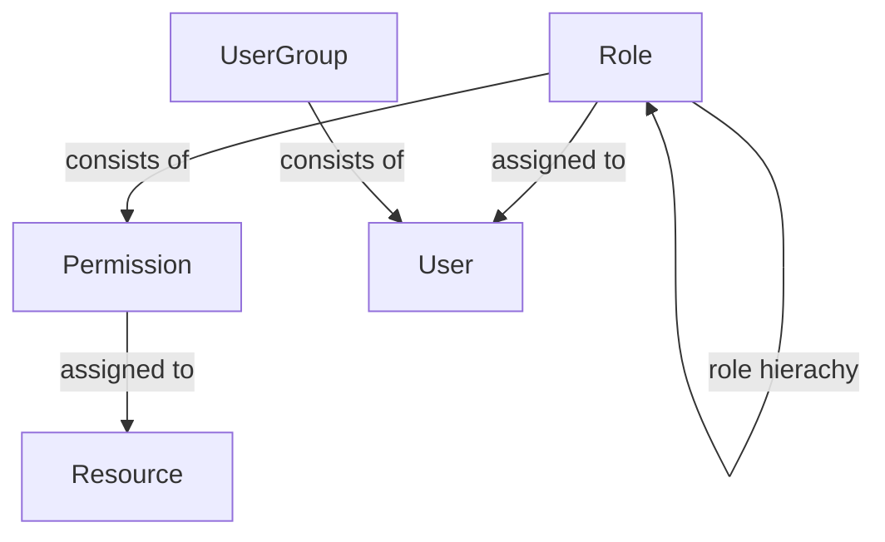

# SILC Server RBAC Design

# SILC Server RBAC Entity Description
1. **Role Entity** 

    Property | Description | Data Type
    -------- | ----------- | ---------
    id | Id of a role(primary key) | GUID
    name | Name of the role(unique) | String
    description | User friendly description of the role | String
    permissions | Array of permission ids assigned to a given role | Array of GUIDs
    parent_role | Reference to parent role to allow for role hierachy and permission inheritance(can be null) | GUID

2. **Permission Entity**

    Property | Description | Data Type | Constraint
    -------- | ----------- | --------- | --------
    id | Id of a permission | GUID | Primary Key
    name | Name of the permission | String | Unique; NotNull
    description | User friendly description of the permission | String | Can be NULL
    resources | Array of references to resources(endpoints) | Array of GUIDs | NotNull

3. **Resource Entity**

    Property | Description | Data Type | Constraint
    -------- | ----------- | --------- | --------
    id | Id of a resource | GUID | Primary Key
    name | Name of the resource | String | Unique; NotNull
    description | User friendly description of the resource | String | Can be NULL
    uri | A uri/url to a resource(path to endpoint) | String | NotNull

