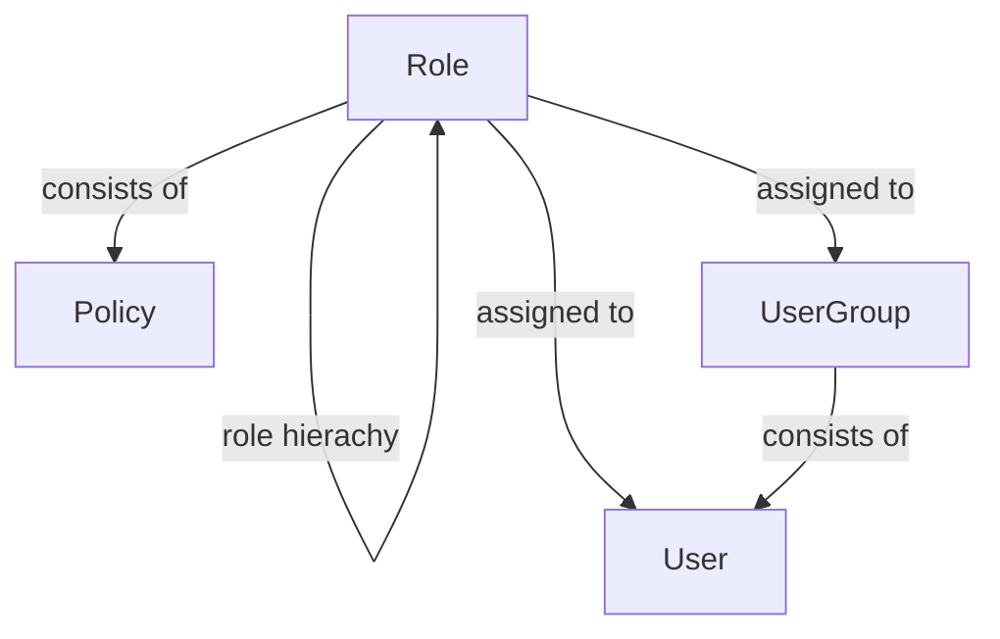

# SILC SERVER RBAC DESIGN

```mermaid
graph TD;
    Role-->|role hierachy|Role
    Role-->|consists of|Policy
    Role-->|assigned to|UserGroup
    Role-->|assigned to|User
    UserGroup-->|consists of|User
```
Reference DHIS2 User Design [here](https://docs.dhis2.org/2.26/en/implementer/html/ch15.html)
Dude, money never shows like it is nothing! Work hard bro...
