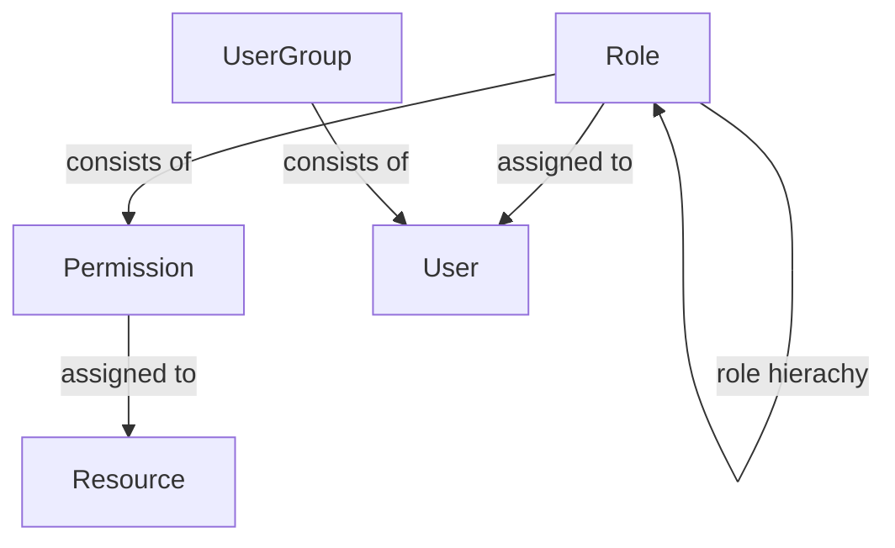
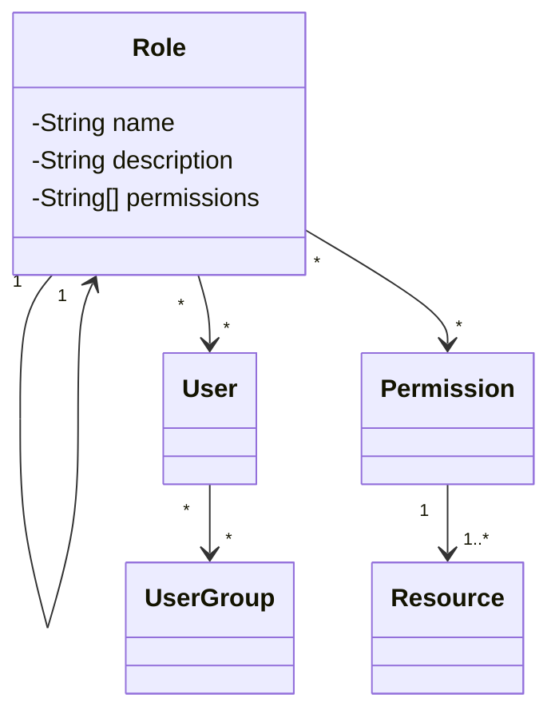

# SILC Server RBAC Design

```mermaid
graph TD;
    Role-->|role hierachy|Role
    Role-->|consists of|Permission
    Permission-->|assigned to|Resource
    Role-->|assigned to|User
    UserGroup-->|consists of|User
```
# SILC Server RBAC Class Diagram

```mermaid
classDiagram
    Role "1" --> "1" Role
    Role "*" --> "*" User
    User "*" --> "*" UserGroup
    Role "*" --> "*" Permission
    Permission "1" --> "1..*" Resource
    class Role{
        -String name
        -String description
        -String[] permissions
    }
```

