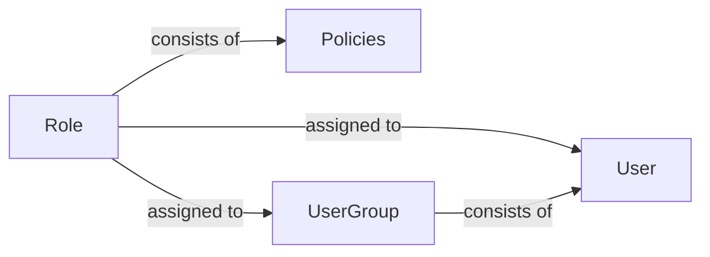
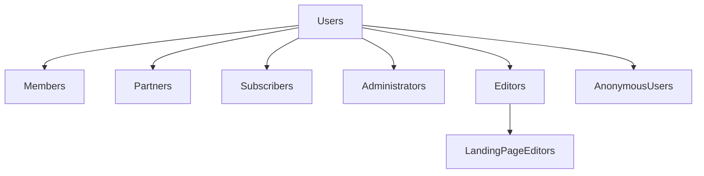
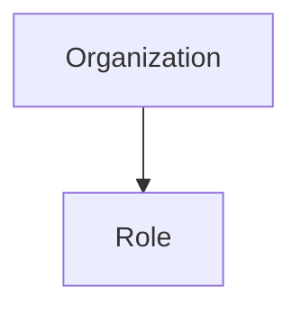

References:
1. [ASP.NET's Membership, Roles, and Profile by  Scott Mitchell](http://aspnet.4guysfromrolla.com/articles/120705-1.aspx)
2. [Blog-Secure by Default: why the role-based permission model offers powerful security by Bård Farstad](https://ez.no/Blog/Secure-by-default-why-the-role-based-permission-model-offers-powerful-security)
3. [Role-based access control, wikipedia](https://en.wikipedia.org/wiki/Role-based_access_control)
4. [Designing an Enterprise Role-Based Access Control(RBAC) System by Justin Baker](https://hackernoon.com/designing-an-enterprise-role-based-access-control-rbac-system-96e645c659b7)
5. [Paper-Role-Based Access Controls by David F. Ferraiolo](https://csrc.nist.gov/CSRC/media/Publications/conference-paper/1992/10/13/role-based-access-controls/documents/ferraiolo-kuhn-92.pdf)
6. [Publications-Computer Security Resource Center,by NIST US GOV ](https://csrc.nist.gov/publications)
7. [Blog-How To Structure Permissions In A SaaS App, by Dorian Johnson](https://heap.io/blog/engineering/structure-permissions-saas-app)
8. [Example Implementation-Sirv Users, Roles and Permissions](https://sirv.com/help/resources/users-roles-permissions/)
9. [Answered Question-How to simplify this Role and Permission Management Design](https://softwareengineering.stackexchange.com/questions/324390/how-to-simplify-this-role-and-permission-management-design)
10. [Blog-Role Based Access Control for Microservices, by ELANKUMARAN SRINIVASAN](https://elang2.github.io/myblog/posts/2018-09-29-Role-Based-Access-Control-MicroServices.html)
11. [Designing a Complete Model of Role-based Access Control
System for Distributed Networks, by CHANG N. ZHANG AND CUNGANG YANG](https://pdfs.semanticscholar.org/8364/990cec1bf92cb2179a351e473fe01056fbc8.pdf)
12. [Users and Roles, by sumo logic](https://help.sumologic.com/Manage/Users-and-Roles)
13. [Simple, Secure Role Based Access Control(RBAC) For REST APIs by Noa Kuperberg](https://cloudify.co/2016/04/15/simple-secure-role-based-access-control-rest-api-rbac-server-devops-cloud-orchestration.html)
14. [Blog-High Level Design of Role Based Access Controller, by Richard at Confluence](https://cwiki.apache.org/confluence/display/SQOOP/High+Level+Design+of+Role+Based+Access+Controller)
15. [Github-Access Control Cheatsheet, by Sheerazali](https://github.com/OWASP/CheatSheetSeries/blob/master/cheatsheets/Access_Control_Cheat_Sheet.md)

# Role-Based Access Design
## Example Role Methods:
1. CreateRole(RoleName): Adds a new role in the system
2. DeleteRole(RoleName): Deletes a role from the system
3. AddUserToRole(Username, RoleName): Adds a particular user to a particular role
4. IsUserInRole(RoleName) or IsUserInRole(Username, RoleName): Checks if the currently logged in or given user is a given role
5. GetAllRoles(): Gets a list of all roles
6. GetRolesForUser() or GetRolesForUser(username): Gets a list of all roles for the currently logged in  or given user

## A) Permission Management
* Roles and Policies
## B) User Management
* Users and User Groups
## C) Anonymous Role
- Even anonymous visitors, i.e., visitors not logged in, have roles assigned to them
- If no functions are defined for a given role, the user can access nothing
## Example Anonymous(Role) Policy
Module | Function | Limitation
------ | -------- | ----------
content | Read | Class(Files, Images, Banners, Users); Section(Media)
content | Read | Section(Standard)
- This design concept means that you, the admin both can see what a specific role a user can access, and that you have to explicitly define if those users should have acess to a function or specific content type
- In this case, the structure of the App should be divided into modules and functions
- Modules and functions can map to controllers and their actions
- Limitations are also applied to queries being done by the search system, making sure content returned is accessible to the current user
## Example Hierarchical Permission Model for User Account

# Role-Based Access Control(RBAC)
- An approach to restricting system access to authorized users
- It can implement Mandatory Access Control(MAC) or Discretionary Access Control(DAC)
- It is defined around roles and privileges
- The components of RBAC such as Role-Permissions, User-Role and Role-Role relationships make it simple to perform user assignments
## RBAC Design
- The permissions to perform certain operations are assigned to specific roles
- Members or staff(or other system users) are assigned particular roles, and through those role assignements acquire the permissions needed to peroform particular system functions
- Since users are not assigned permissions directly but only acquire them through their role(or roles), management of individual user rights becomes a matter of simply assigning appropriate roles to the user's accounts
## Three Primary Rules That Define RBAC
### 1. Role Assignment
- A subject can exercise a permission only if the subject has selected or been assigned a role
### 2. Role Authorization
- A subject's active role must be authorized for the subject
- With Rule 1, this rule ensures that users can take only roles for which they are authorized
### 3. Permission Authorization
- A subject can exercise a permission only if the permission is authorized for the subject's active role
- With Rules 1 and 2, this ensures that users can exercise only permissions for which they are authorized
## RBAC Model Conventions
- When defining an RBAC model, the following conventions are useful:
1. S = Subject = A person or automated agent
2. R = Role = Job function defining an authority level
3. P = Permission = An approach of a mode of access to resources
4. SE = Session = A mapping involving S, R, and/or P
5. SA = Subject Assignment
6. PA = Permission Assignment
7. RH = Partially ordered role hierarchy
- RH can also be written as: &GreaterEqual;(The notation: x&GreaterEqual;y means that x inherits the permissions of y)
- A subject can have multiple roles
- A role can have multiple subjects
- A role can have many permissions
- A permission can be assigned to many roles
- An operation can be assigned to many permissions
- A permission can be assigned to many operations

### _NOTE: Constraints_
- A constraint places a restrictive rule on the potential inheritance of permissions from opposing roles, thus it can be used to achieve separation of duties
- For example, the same person should not be allowed to both create a login account and to authorize the account creation
- Using set theory notation:

  1. PA &SubsetEqual; P X R and is a many to many permission to role assignment relation
  2. SA &SubsetEqual; S X R and is a many to many subject to role assignment relation
  3. RH &SubsetEqual; R X R 
- A subject may have multiple simultaneous sessions within different roles
## RBAC Model Diagram

